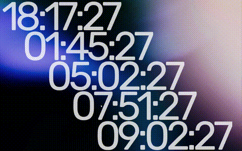

# Multi-Event Countdown Widget

A Rainmeter skin that displays countdowns to multiple daily events based on a CSV schedule.




## Features

- Displays up to 5 concurrent event countdowns
- Automatically updates to the next day's events
- Customizable through the CSV file
- Clean, modern display with configurable fonts and colors
- Real-time updates every second
- Supports events spanning multiple days

## Use Case: Five Daily Prayer Times

This widget was originally designed to display countdowns to the 5 daily Islamic prayer times, but it can be easily adapted for any scheduled events by modifying the `Times.csv` file.

## Dependencies

1. [Rainmeter](https://www.rainmeter.net/) (version 4.0 or later recommended)
2. [Rubik font](https://fonts.google.com/specimen/Rubik) - Required for proper display

## Installation

1. Install the required dependencies listed above
2. Download this repository or clone it to your local machine
3. Copy the `MultiEventCountdownWidget` folder to your Rainmeter skins directory:
   - **Windows**: `C:\Users\[YourUsername]\Documents\Rainmeter\Skins\`
4. Open Rainmeter
5. Right-click on the Rainmeter tray icon and select "Refresh all"
6. Right-click on the Rainmeter tray icon again and select "Skins"
7. In the Skin Browser window, expand "MultiEventCountdownWidget" and click on the skin to activate it

## Configuration

### Editing Event Times

Modify `Times.csv`:

```
Date,Event1,Event2,Event3,Event4,Event5
2025-06-01,04:52,12:27,15:51,18:36,19:50
...
```

- **Date**: In `YYYY-MM-DD` format
- **Event1-Event5**: Times in 24-hour `HH:MM` format

The widget will automatically find the next occurrence of each event type. For example, if you have an event in the "Event1" column at 05:00 every day, the widget will always show the countdown to the next 05:00, whether it's today or tomorrow.

### Customizing Appearance

Edit variables in `MultiEventCountdownWidget.ini`:

- `Scale`: This is if you want to just scale the whole thing proportionally

- `FontColour`: Text color (R,G,B,A)
- `FontSize`: Size of the countdown text
- `FontFace`: Font family (currently set to "rubik")
- `FontWeight`: Thickness of the font
- `InlineSetting`: Character spacing (adjust if needed for different fonts)

You can also adjust the positioning by modifying the `X` and `Y` values in the meter sections.

## How It Works

The widget uses a Lua script (`ReadEventTimes.lua`) to parse the CSV file and calculate the time remaining for each event. It updates every second to provide real-time countdowns.

Key features of the implementation:
- Each event column (Event1-Event5) is treated as a separate event type
- The widget automatically finds the next occurrence of each event type
- When an event time passes, it immediately starts counting down to the next occurrence
- The display format shows hours, minutes, and seconds, with days prefixed when applicable

## Troubleshooting

1. **Widget shows "Calculating..."**: 
   - Ensure the `Times.csv` file is properly formatted
   - Check that the file path in `MultiEventCountdownWidget.ini` is correct

2. **Incorrect times displayed**:
   - Verify that your system time is set correctly
   - Check that the dates in `Times.csv` are in the future

3. **Font issues**:
   - Make sure the Rubik font is installed on your system
   - Alternatively, change the `FontFace` variable to a font that is installed

4. **Widget not updating**:
   - Try refreshing Rainmeter (`Right-click tray icon > Refresh all`)
   - Check that Rainmeter's update rate is set appropriately

## License

GNU General Public License v3.0

This project is licensed under the GNU General Public License v3.0. See the [LICENSE](LICENSE.txt) file for details.
